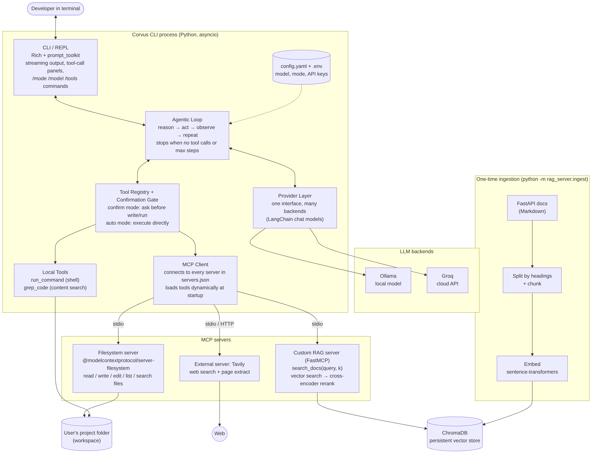

# Corvus

**An autonomous coding assistant for your terminal.**

Give Corvus a task in plain English. It reads your code, makes changes, runs commands, looks things up in docs or on the web, checks the results, and keeps going until the task is done. Every tool call shows up on screen, and by default it asks before it writes a file or runs a command.

> **Project status: planning phase (Oct 1, 2026).** No implementation code yet. This commit contains our initial architecture and project plan. Setup instructions below are what we're planning and will be finalized as we build.

ITCS 5010 · Group Project 2: CLI Coding Assistant · Group __ <!-- fill in -->

## Planning documents
- [Initial architecture (v1)](docs/ARCHITECTURE.md): components, diagram, design decisions, risks
- [Project plan](docs/PROJECT_PLAN.md): roles, interfaces, week-by-week timeline, check-in goals



## What it will do
- **Agentic loop:** reason → call tools → observe results → repeat, until the task is finished
- **Two LLM backends:** local models through Ollama, cloud models through Groq, switchable at runtime
- **Three MCP servers, loaded dynamically:**
  - Filesystem (`@modelcontextprotocol/server-filesystem`): read, write, edit, and search files
  - Tavily: web search
  - `docs-rag` (ours): searches the FastAPI documentation using vector search + cross-encoder **reranking**
- **Confirm or auto mode:** approve each file write and shell command, or let it run on its own
- **Readable terminal UI:** streaming responses, a panel for every tool call, status spinners

## Team

| Name | Role |
|---|---|
| Soumyanil Ain | Lead, agent core |
| Sogol Maghzian | MCP client + tools |
| _Teammate 3_ | RAG server |
| Sumiran Juthuga | CLI + diagrams |

## Planned tech stack
Python 3.11+, LangChain (`langchain-ollama`, `langchain-groq`), `mcp` Python SDK + `langchain-mcp-adapters`, ChromaDB, sentence-transformers, Rich, prompt_toolkit, Node.js 18+ (for the npx-based MCP servers).

## Setup (planned, will be finalized)

```bash
git clone <this repo>
cd corvus
python -m venv venv
# Windows: venv\Scripts\Activate.ps1    macOS/Linux: source venv/bin/activate
pip install -r requirements.txt

cp .env.example .env          # then add your GROQ_API_KEY and TAVILY_API_KEY
ollama pull qwen2.5-coder:7b  # or whichever local model we settle on

python -m rag_server.ingest   # one time only: builds the vector database
python -m corvus              # start the assistant
```
