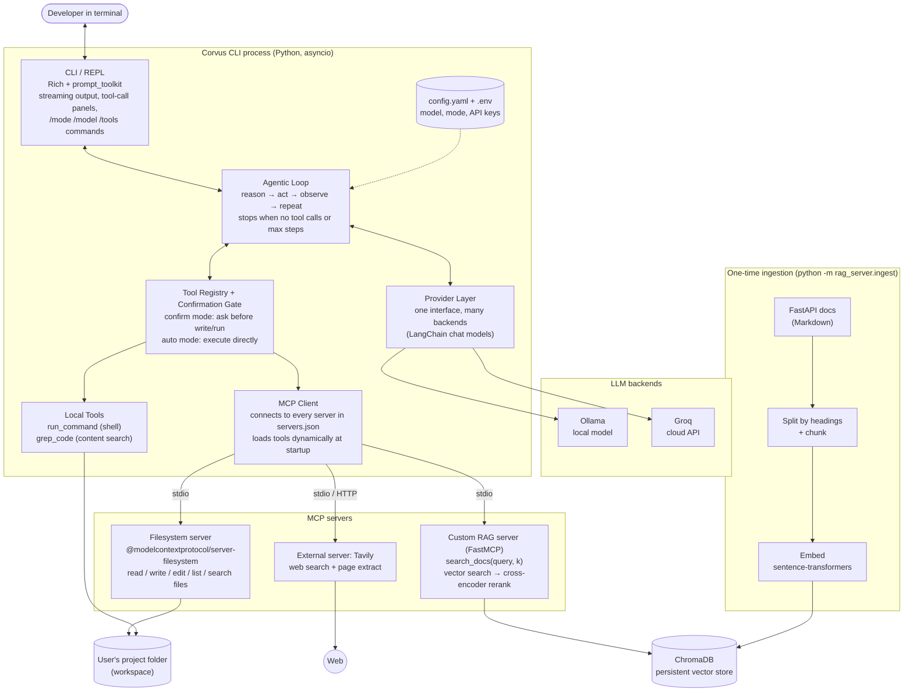

# Corvus — Initial Architecture (v1, planning phase)

> Status: **planning draft, Oct 1 2026.** This is our design before any code was written. It will change as we build. When it does, we keep this file as the original and add `ARCHITECTURE_v2.md` explaining what changed and why (the final report needs both).

## What we're building

Corvus is a command-line coding assistant. You type a task in plain English ("add input validation to the signup endpoint and run the tests"), and it works on its own: it reads files, edits code, runs commands, looks things up, checks the results, and keeps going until the job is done.

The name comes from *Corvus*, the crow genus. Crows are one of the few animals that make and use tools, which is exactly what this agent does.

## Architecture diagram


Mermaid source: [`diagrams/architecture-v1.mmd`](diagrams/architecture-v1.mmd) (GitHub renders the block below too)



## Components

### 1. CLI / REPL (`corvus/cli/`)
The part the user sees. Built with **Rich** (panels, colors, spinners, live streaming) and **prompt_toolkit** (input history, multi-line input).

- Streams the model's answer token by token.
- Every tool call gets its own panel: tool name, which server it came from, the arguments, and a short preview of the result. Tool calls should never be hidden.
- Spinner/status line while a tool or the model is working.
- Slash commands: `/mode confirm|auto`, `/model ollama|groq`, `/tools` (list loaded tools grouped by server), `/clear`, `/help`, `/exit`.

### 2. Agentic loop (`corvus/agent/`)
The core. We are writing this loop ourselves instead of using a prebuilt agent (like LangGraph's `create_react_agent`) because we need full control over streaming, the confirmation step, and what gets shown on screen.

```
messages = [system_prompt, user_task]
for step in range(MAX_STEPS):            # safety cap, ~25
    response = stream(llm_with_tools, messages)   # tokens go to the CLI as they arrive
    messages.append(response)
    if not response.tool_calls:
        break                            # model is done, final answer already shown
    for call in response.tool_calls:
        if needs_confirmation(call) and mode == "confirm":
            if not ask_user(call):       # user said no
                messages.append(ToolMessage("User rejected this action", call.id))
                continue
        result = await registry.run(call)          # MCP tool or local tool
        messages.append(ToolMessage(truncate(result), call.id))
```

Things it handles:
- **Stopping**: ends when the model answers without asking for a tool, or when it hits `MAX_STEPS`.
- **Errors**: a failed tool call is sent back to the model as the tool result ("Error: file not found...") so it can try something else, instead of crashing the session.
- **Large outputs**: tool results get truncated before going back into the prompt so we don't blow the context window (important for the smaller Ollama models).
- **Rejections**: if the user says no to a step, the model is told and can choose another approach.

### 3. Provider layer (`corvus/providers/`)
Makes the agent model-agnostic. One factory function, `get_chat_model(provider, model_name)`, returns a LangChain chat model that supports `.bind_tools()` and `.astream()`. The loop never imports a provider directly.

| Provider | Package | Planned models (final pick after a tool-calling test on Oct 4) |
|---|---|---|
| Ollama (local) | `langchain-ollama` | `qwen2.5-coder:7b` or `llama3.1:8b` |
| Groq (cloud) | `langchain-groq` | `llama-3.3-70b-versatile` or another tool-calling model on Groq |

Adding a third provider (OpenAI, Anthropic) should be one new branch in the factory and one line in `config.yaml`. Switching works at runtime with `/model`.

### 4. Tool registry + confirmation gate (`corvus/tools/`)
One place that holds every tool the model can call, whether it came from an MCP server or is a local Python function. The loop just calls `registry.run(tool_call)`.

Each tool is tagged as **read-only** or **mutating**:

| Read-only (always runs) | Mutating (asks first in confirm mode) |
|---|---|
| read_text_file, list_directory, directory_tree, search_files, grep_code, search_docs, Tavily search/extract | write_file, edit_file, move_file, create_directory, run_command |

In **confirm mode** the user sees the exact action (the command, or the file and a diff preview for edits) and answers `y` / `n` / `a` (always allow this tool for the session). In **auto mode** everything runs without asking. Unknown tools default to mutating, so a new server can't silently write anything.

### 5. MCP client (`corvus/mcp_client/`)
Reads `servers.json`, starts or connects to every server listed there, and pulls each server's tool list at startup. Nothing about specific tools is hard-coded, so adding a server is a config change, not a code change. Built on the official `mcp` Python SDK via `langchain-mcp-adapters` (`MultiServerMCPClient`), wrapped in our own class so the rest of the app doesn't depend on that library.

Planned `servers.json`:

```json
{
  "filesystem": {
    "transport": "stdio",
    "command": "npx",
    "args": ["-y", "@modelcontextprotocol/server-filesystem", "${WORKSPACE}"]
  },
  "tavily": {
    "transport": "stdio",
    "command": "npx",
    "args": ["-y", "tavily-mcp"],
    "env": { "TAVILY_API_KEY": "${TAVILY_API_KEY}" }
  },
  "docs-rag": {
    "transport": "stdio",
    "command": "python",
    "args": ["-m", "rag_server.server"]
  }
}
```

(On Windows, `npx` may need to be `npx.cmd`. We'll handle that in code.)

### 6. Local tools
The filesystem server can read and write files but cannot run commands or search inside file contents, so we add two small tools ourselves:
- `run_command(command, timeout=60)`: runs a shell command in the workspace and returns stdout, stderr, and exit code. Always mutating. Has a timeout and a short blocklist (e.g. `rm -rf /`, `format`, `shutdown`).
- `grep_code(pattern, path=".")`: searches file contents with a regex, like ripgrep. Read-only.

### 7. MCP servers

| # | Server | Type | Why |
|---|---|---|---|
| 1 | `@modelcontextprotocol/server-filesystem` | Official, stdio via npx | Required. Read/write/edit/list/search files, locked to the workspace folder we pass in. |
| 2 | **Tavily** (`tavily-mcp`) | External, stdio via npx (remote HTTP is an option) | Required external server. Web search for error messages, package versions, things outside our docs. Needs a free Tavily API key. |
| 3 | **docs-rag** (ours) | Custom, Python, FastMCP over stdio | Required custom RAG server. Answers questions from the FastAPI documentation. |

Stretch: add **Context7** as a second external server if time allows.

### 8. Custom RAG server (`rag_server/`)

**Corpus:** the FastAPI documentation (Markdown files from the `fastapi/fastapi` repo, `docs/en/docs`). We picked FastAPI because the docs are clean Markdown with lots of code examples, and it gives us realistic demo tasks ("add a FastAPI endpoint with request validation").

**Ingestion (run once):** `python -m rag_server.ingest`
1. Load the `.md` files.
2. Split on Markdown headings first, then into ~800-character chunks with overlap. Keep metadata: file, section heading, URL.
3. Embed with `sentence-transformers/all-MiniLM-L6-v2` (runs locally on CPU, free).
4. Store in a persistent **ChromaDB** collection at `data/chroma/`.

If the collection already exists, the server skips straight to loading it. Every later session reuses the same database.

**Advanced RAG technique: Reranking** (NirDiamant RAG_Techniques #17, "Advanced Retrieval" section).
- Step 1: vector search pulls a wide set of candidates (top 20).
- Step 2: a cross-encoder (`cross-encoder/ms-marco-MiniLM-L-6-v2`) scores each candidate against the actual query, which is much more accurate than embedding similarity alone.
- Step 3: return the top 5 after reranking, each with its source file and section.

Why reranking: plain embedding search on docs tends to return chunks that share keywords but don't answer the question. A cross-encoder reads the query and chunk together, so it fixes that. It's also easy to measure: we can turn it off and compare.

**Tool exposed to the agent:**
```
search_docs(query: str, k: int = 5) -> str
    "Search the FastAPI documentation. Use for questions about FastAPI APIs,
     parameters, request/response models, dependencies, and examples."
```
The description matters: it's how the model decides when to call this tool instead of Tavily.

**Evaluation plan:** ~20 hand-written questions, each with the doc file that should answer it. Run retrieval with and without reranking and compare hit rate @5 and MRR. Results go in the final report.

## How one task flows

Example: *"Add a /health endpoint to app.py that returns the app version, then run the tests."*

1. User types the task in the REPL. CLI hands it to the agent loop.
2. Loop sends system prompt + task + all tool schemas to the selected LLM.
3. Model asks for `read_text_file("app.py")` → filesystem server → result shown in a panel → sent back to the model.
4. Model asks for `search_docs("FastAPI path operation response")` → RAG server → top 5 reranked chunks → back to the model.
5. Model asks for `edit_file(...)`. Confirm mode: CLI shows the diff and asks `y/n/a`. User says yes → filesystem server writes the change.
6. Model asks for `run_command("pytest -q")`. Confirm mode: user approves → local tool runs it → output back to the model.
7. Tests pass. Model replies with a summary and no tool calls → loop ends → answer streamed to the screen.

If the tests had failed, step 6's output would go back to the model, and it would read the error, fix the code, and run them again. That's the loop.

## Planned repo layout

```
corvus/
├── corvus/
│   ├── __main__.py          # entry point: python -m corvus
│   ├── config.py            # loads config.yaml + .env
│   ├── cli/                 # REPL, rendering, slash commands
│   ├── agent/               # agentic loop, system prompt
│   ├── providers/           # get_chat_model() factory
│   ├── mcp_client/          # MultiServerMCPClient wrapper
│   └── tools/               # registry, confirmation gate, run_command, grep_code
├── rag_server/
│   ├── ingest.py            # one-time: load → chunk → embed → store
│   ├── retriever.py         # vector search + cross-encoder rerank
│   └── server.py            # FastMCP server exposing search_docs
├── eval/                    # RAG eval questions + LLM comparison tasks
├── data/                    # chroma db + raw docs (gitignored)
├── docs/                    # architecture, plan, diagrams, report
├── servers.json
├── config.yaml
├── requirements.txt
└── README.md
```

## Key design decisions

| Decision | Why |
|---|---|
| Python + LangChain | We have all used it earlier in this course; `bind_tools` gives us one tool-calling API across Ollama and Groq. |
| Hand-written loop instead of a prebuilt agent | We need to stream, show every tool call, and pause for confirmation in the middle of a step. Also, the loop is the main thing being graded. |
| Groq as the cloud provider | Free tier, very fast, supports tool calling. OpenAI/Anthropic would need paid credits. |
| MCP for files instead of our own file functions | Required, and it means file access is sandboxed to one folder by the server itself. |
| stdio transport for all local servers | Simplest to run: the client starts the servers as child processes, no ports to manage. |
| ChromaDB, persistent on disk | Ingest once, reuse forever. Matches the "only run setup once" requirement. |
| Reranking as the advanced technique | Clear accuracy win for docs search, and easy to A/B test for the report. |
| Confirm mode is the default | Safer for a tool that can edit files and run commands. Auto mode is one command away. |

## Risks and open questions

| Risk | Plan |
|---|---|
| Small Ollama models are bad at tool calling (wrong JSON, made-up tool names) | Test 2–3 models on Oct 4 and pick the best. Keep tool count small for Ollama runs. Validate tool names before running. |
| Groq free-tier rate limits during testing and the demo | Each member uses their own key while developing; space out runs when recording the demo; Ollama is the fallback. |
| `npx` servers on Windows | Use `npx.cmd` on Windows; document Node.js 18+ in setup. |
| Context window fills up on long tasks | Truncate tool output, cap steps, keep the system prompt short. |
| Model picks the wrong search tool (Tavily vs docs-rag) | Write clear tool descriptions; test with mixed questions. |
| Someone commits an API key | `.env` is gitignored; only `.env.example` with blank values is committed. |
